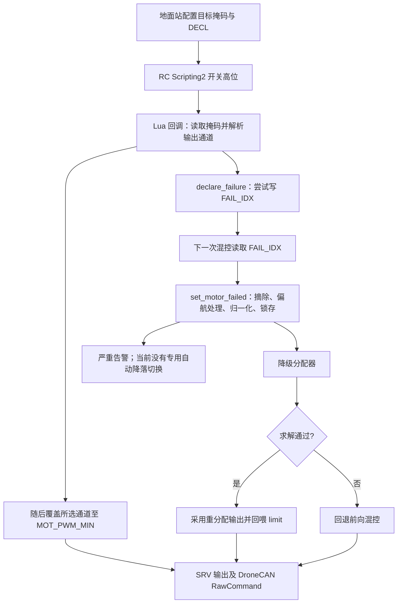

# P04 主动前馈与单电机故障处置：机制、步骤及改进建议

署名：ChatGPT（OpenAI Codex）——源码审查、隔离验证与文档编写。

编制日期：2026-09-05。

## 1. 结论与适用范围

当前现场方案的“主动前馈”是**试验脚本把自己即将停掉的电机编号直接申报给混控器**。它能绕过转速判定及确认等待，提前进入降级控制；它不具备预知自然故障的能力，也不是根据推力损失大小计算补偿量的连续前馈控制器。应称为“已知故障注入 + 前馈申报 + 降级重分配”。

这条路线适合分阶段验证控制侧，但当前实现存在应先修复的联锁缺口：多位掩码仍会实际停多台电机；申报对象和输出覆盖对象可以分离；摘除电机没有配套的底层持续停机输出；解锁检查只看参数，没有覆盖已降级的运行状态。此外，分配器失败会回退，不能把“总推力、滚转、俯仰必定满足”作为全工况保证。

建议顺序是：**先补注入与输出联锁，再补分配失败处置和证据记录，再完成遥测检测标定与应急着陆衔接，最后优化偏航与算力。** 当前不应优先提高 `MOT_FAIL_YTRK` 或放宽故障门限。

本次交付是审查文档，没有修改飞控、脚本、参数或试飞配置。本文中的缺陷描述区分源码事实、隔离复现和待整机验证的影响；没有把历史文档中的仿真数字当成本次测试结果。

## 2. 审查基线与证据等级

| 项目 | 本次基线 |
| :-- | :-- |
| 当前工作目录 | `/home/yuli/UAV-work/P04-motor-failure`，Git linked worktree |
| 当前分支 / 提交 | `feat/P04-motor-failure` / `45740f853b` |
| 集成主干 | `/home/yuli/UAV/ardupilot`，`dev-algo` / `a87092a729`（审查开始时） |
| 默认机架 | `EFT_CAAC/defaults.parm`：`FRAME_CLASS=2`、`FRAME_TYPE=13`，HEXA/DJI_X |
| 主循环配置 | `SCHED_LOOP_RATE=400`；名义周期 2.5 ms |
| 文档落点 | 按用户明确要求，本 P04 专题审查在 `feat/P04-motor-failure` 的 `docs/` 独立维护 |

两个分支并非相同固件。审查开始时 `git diff --stat dev-algo..HEAD` 为 10 个文件、373 行增加、17 行删除；P04 worktree 包含主干尚无的 `MOT_STOP_DECL`、掉桨检测 `MOT_FAIL_ROVR`、`MOT_FAIL_YTRK` 及对应仿真扩展。因此，不能在主干旧固件上仅加载现场参数文件就认定该能力存在。本文在 P04 分支维护，文档提交不代表这些代码已集成主干，更不代表固件已可放行。

证据分级：

- **S（源码确认）**：直接检查条件、状态写入和调用关系。
- **L（Lua 隔离复现）**：实际加载上述提交的脚本，使用模拟 API 执行；不接飞控。
- **N（数值反例）**：按源码矩阵和迭代规则建立 NumPy 模型；不是编译后的 C++ 或 SITL 实测。
- **V（待验证）**：需要固件、输出后端、台架或闭环飞行试验确认的后果。

主要源码锚点均固定到本次 P04 提交，避免后续行号变化影响追溯：

| 编号 | 源码及职责 |
| :-- | :-- |
| S1 | [motor_failure_test.lua](https://github.com/xyfyf/ardupilot/blob/45740f853b/ROMFS_custom/scripts/motor_failure_test.lua)：参数、开关、申报、输出覆盖 |
| S2 | [AP_MotorsMatrix.cpp](https://github.com/xyfyf/ardupilot/blob/45740f853b/libraries/AP_Motors/AP_MotorsMatrix.cpp)：146–185 输出，216–450 混控入口，623–812 检测，818–1088 分配，1098–1272 回喂与摘除，2022 起归一化 |
| S3 | [AP_MotorsMulticopter.cpp](https://github.com/xyfyf/ardupilot/blob/45740f853b/libraries/AP_Motors/AP_MotorsMulticopter.cpp)：234–304 参数，318 起输出调用，848 起解锁检查 |
| S4 | [AP_ESC_Telem.cpp](https://github.com/xyfyf/ardupilot/blob/45740f853b/libraries/AP_ESC_Telem/AP_ESC_Telem.cpp)：184 起插值 RPM，末尾遥测超时失效处理 |
| S5 | [SRV_Channels.cpp](https://github.com/xyfyf/ardupilot/blob/45740f853b/libraries/SRV_Channel/SRV_Channels.cpp)：401 起覆盖计数，451 起限时 PWM 覆盖；[SRV_Channel.cpp](https://github.com/xyfyf/ardupilot/blob/45740f853b/libraries/SRV_Channel/SRV_Channel.cpp)：224 起 PWM 保留规则 |
| S6 | [AP_DroneCAN.cpp](https://github.com/xyfyf/ardupilot/blob/45740f853b/libraries/AP_DroneCAN/AP_DroneCAN.cpp)：721 起 ESC 换算，826 起 RawCommand，930 起输出缓存，1479 起遥测索引 |
| S7 | [Log.cpp](https://github.com/xyfyf/ardupilot/blob/45740f853b/ArduCopter/Log.cpp)：294 起 MALC；[Copter.cpp](https://github.com/xyfyf/ardupilot/blob/45740f853b/ArduCopter/Copter.cpp)：25 Hz 日志任务 |
| S8 | [reproduce.py](https://github.com/xyfyf/ardupilot/blob/45740f853b/Tools/eft_issue_repro/reproduce.py)：2466 起 `run_motor_fail()`；[regression.py](https://github.com/xyfyf/ardupilot/blob/45740f853b/Tools/eft_issue_repro/regression.py)：P04 用例 |
| S9 | [AP_MotorsMatrix.h](https://github.com/xyfyf/ardupilot/blob/45740f853b/libraries/AP_Motors/AP_MotorsMatrix.h)：失效状态、计时器及几何缓存；[AP_Arming_Copter.cpp](https://github.com/xyfyf/ardupilot/blob/45740f853b/ArduCopter/AP_Arming_Copter.cpp)：电机解锁检查调用 |

另对照了父仓库中的 `airworthiness/params/P04_现场前馈注入_20260904.param`、`airworthiness/P04现场执行卡_20260904.md`、`airworthiness/P04真机试验大纲_20260904.md`、`docs/P04降级分配器_算法与防护_20260904.md`。这些材料作为历史说法对照，未在本次修改，也不是本 ArduPilot 提交的附件。

## 3. 三条触发路径的区别

| 路径 | 谁知道故障编号 | 触发条件 | 能证明什么 |
| :-- | :-- | :-- | :-- |
| 主动注入、前馈申报 | Lua 已知 `MOT_STOP_BITMASK` | 开关高位且 `MOT_STOP_DECL=1`，写 `MOT_FAIL_IDX` | 已知故障后的混控切换和控制响应；还需证明注入链本身正确 |
| 自动停转检测 | 飞控从 ESC RPM 推断 | 指令推力足够、有效 RPM 低于门限并持续确认 | 所覆盖工况下的停转发现、隔离和处置 |
| 自动掉桨检测 | 飞控从转速与指令关系推断 | 学习后的相对空载指标超阈值并持续确认 | 所覆盖工况下的异常卸载发现；不能包办所有部分损伤 |

三条路径最终调用 `set_motor_failed()`。另有上游风格的 `check_for_failed_motor()` / `thrust_loss_check()`：它们从指令不平衡、下降等条件识别潜在推力不足并触发 thrust boost，不等于本 fork 的 ESC 定位与摘列链路。上游文档也将相关消息描述为推力饱和、偏航不平衡告警。[ArduPilot 官方说明](https://ardupilot.org/copter/docs/thrust_loss_yaw_imbalance.html)

现场参数文件采用：

| 参数 | 现场文件值 | 代码默认值 / 作用 |
| :-- | --: | :-- |
| `SCR_ENABLE` | 1 | 允许脚本；还必须有 `RCx_OPTION=301`，否则脚本直接退出 |
| `MOT_STOP_DECL` | 1 | 脚本默认 0；1 为直接申报 |
| `MOT_STOP_BITMASK` | 32 | 脚本默认 0；32 对应逻辑电机 6，不天然等于任意机体的物理第六臂 |
| `MOT_FAIL_IDX` | 0 | 默认 0；人工测试入口，非零值会阻止常规解锁检查通过 |
| `MOT_FAIL_ALLOC` | 1 | 默认 1；故障后尝试重分配，0 仍然会摘电机，只是用前向混控 |
| `MOT_FAIL_YAW` | 0 | 默认 0；缩放前向混控偏航因子；与 ALLOC>0 且 YAW≠0 的组合有解锁检查 |
| `MOT_FAIL_YSUP` | 0.7 | 默认 0.7；改变剩余推力分配对寄生偏航的偏好 |
| `MOT_FAIL_YTRK` | 1 | 默认 0；把上述软目标偏向偏航需求，不能据此承诺保航向 |
| `MOT_FAIL_OPP` | 0 | 默认 0；对角摘除可选项存在实现问题，见 A12 |
| `MOT_FAIL_RPM` / `MOT_FAIL_ROVR` | 0 / 0 | 默认均为 0；现场配置关闭两种自动检测 |
| `MOT_FAIL_TIME` / `MOT_FAIL_THST` | 未覆盖 | 默认 200 ms / 0.15；只在相应检测启用时参与判断 |

## 4. 主动前馈的实际过程



图中的 D 与 E 是两条作用链，并非原子事务；脚本中先调用 D，再执行 E，D 的失败或拒绝并不阻止 E。这是 A01/A02 的根源。

1. **准备与通道映射。** 脚本寻找选项 301 对应的 RC 通道，再创建两个 `MOT_STOP_*` 参数。对掩码中的逻辑电机 1–12，使用电机输出功能号查找实际 SRV 通道。实际测试前必须核对逻辑电机、输出功能、物理臂位、旋向和 ESC 索引。
2. **软件申报。** 开关为高位，且 DECL=1、尚未申报时，脚本数掩码位数。零位等待；多位告警并锁住申报机会；单位置 `declared=true` 后调用 `param:set("MOT_FAIL_IDX", N)`。这是 RAM 写入，没有 `set_and_save`。
3. **物理注入命令。** 无论上一步是否成功，脚本遍历当前掩码解析出的通道，覆盖到 `MOT_PWM_MIN`，每 10 ms 申请下一次回调，每次覆盖 15 ms。对于现场所述非可逆 DroneCAN、且 PWM 缩放上下限正确的配置，该最小值换算为 `RawCommand=0`。这仍是“发出了停机命令”，转子实际停转要经历 ESC 响应和惰走。
4. **混控接收。** `output_armed_stabilizing()` 首先调用自动检测，然后读取 `MOT_FAIL_IDX`。非零且 `_failed_motor<0` 时立即尝试摘除。读取参数的这个分支本身没有 `armed()` 判断，不能依据函数名宣称只在解锁后执行。
5. **修改控制结构。** `remove_motor()` 清除 `motor_enabled` 和该电机四类因子；随后保存幸存电机的 `_yaw_geom`，按 FAIL_YAW 处理当前偏航混控因子，再归一化，最终锁存 `_failed_motor=N-1`。不主动清空速率 PID 积分。
6. **重新分配。** 仍先计算原前向混控的限幅与油门，再在故障分支调用 `allocate_redistributed(demand, false, ...)`。成功才覆盖原输出；失败则继续前向路径。故障编号并不因此复原。
7. **输出与反馈。** 输出经过推力线性化、slew/spool 等执行阶段，送 SRV 和相应后端。成功分配时计算代数 achieved 回喂限幅，并允许 MALC 记录。它不是实际测得的升力与力矩。
8. **告警及处置。** 发出 `Motor N failed: mixer degraded`，但当前没有由这个故障状态自动触发的 LAND 或任务中止状态机。飞手接管/地面脚本切模式属于链路外的处置。

**时延应分项记录。** 开关输入传输 + RC 更新 + Lua 调度等待 + 参数可见性/下次混控 + 输出提交/CAN + ESC 响应 + 转子动力学，才是实际全过程。10 ms 与 2.5 ms 是名义调度周期，15 ms 是输出覆盖请求期限；它们均非端到端最坏时延证明。“零检测延迟”仅指没有走 RPM 判据确认窗口。

## 5. 自动发现路径的原理和边界

### 5.1 停转检测

仅在编译包含 ESC 遥测、已解锁、尚未降级、`MOT_FAIL_RPM>0` 时判定。对每个已启用电机，使用**前一轮混控保存的推力指令** `u_i=_thrust_rpyt_out[i]` 与 `get_rpm(i)`：

```text
u_i >= MOT_FAIL_THST 且 RPM 有效
    RPM < MOT_FAIL_RPM：timer_i += dt
    否则：timer_i = 0
指令过小或 RPM 无效：timer_i = 0
timer_i >= MOT_FAIL_TIME：本轮计为确认对象
```

全机恰好一个确认对象才摘除；多个同类确认对象时只告警，节流至最多约 1 Hz。这避免同轮摘掉多台，但只统计“已确认数”，不代表已经排除其他正在发展中的可疑通道。

默认 200 ms 是低于门限后的确认时间，不包括从停机到 RPM 越过门限的惰走时间。若转速近似 `RPM(t)=RPM0·exp(-t/τ)`，仅越门限就需要 `τ·ln(RPM0/RPM_min)`；τ、低速可观测性及遥测延迟需要实测。

### 5.2 掉桨 / 异常卸载检测

`MOT_FAIL_ROVR>0` 开启。对满足指令门槛且 `u_i>=0.05` 的有效读数：

```text
k_i = RPM_i / sqrt(u_i)
s_i = k_i / median(k_valid)
参考 ref_i：首次有效样本初始化，正常时以 dt/10s 的系数学习
累计有效学习 >= 5s 后：s_i > ref_i * MOT_FAIL_ROVR 持续确认才认定
可疑时冻结 ref_i，防止学习过程追上故障
```

至少四路有效 `k` 才进入中位数与学习判断。停转分支已经有确认对象时，掉桨判断不再执行。丢桨可能表现为卸载增速，所以仅低转速判据覆盖不到；但这里的 `u_i` 是指令而非实测推力，瞬态、电机惯性、输出限幅、空速和不同桨的气动关系都可能改变 `k_i`。归一化减少共模变化，不等于免标定，也不等于任何掉桨都必然增速到设定比例。

### 5.3 当前盲区

RPM 消失会重置确认计时，而不是确认停转。ESC 掉电、总线中断与“仍在线并报告低 RPM”是不同故障模式。另一个方向上，`get_rpm()` 可返回仍处于有效期的旧值并做插值；RPM 通用超时为 1 s，检测确认默认却是 0.2 s，循环重复读同一旧样本不能算多个独立故障证据。具体误报或漏报取决于最后读数和后续更新时序（A09）。

## 6. 分配器真正求解的内容

### 6.1 主约束、软偏航与失败出口

对剩余 n 台电机，矩阵 B 的三行为油门、滚转因子、俯仰因子，列为电机。生产调用始终 `include_yaw=false`。代码将输入油门乘**剩余电机数 n** 后组成总量需求 d，在 `0<=u<=1` 下尝试满足 `B·u=d`。

无偏航偏好时的自由电机解为 `u=Bᵀ(BBᵀ)⁻¹d`；有偏航偏好时用 `_yaw_geom` 修正选解。越界电机被一次性钳在 0 或 1，扣除其贡献，继续求自由电机。求逆失败、非有限值或回代残差过大时返回失败；只有一次完全无新钳位的求解才算成功。迭代次数有界，不等于必然找到可行解或最优解。

已存在的 `have_solution`、有限值检查、回代校验有效防止部分数值失败被当作成功，应保留。但这些防护只证明内部代数求解的有限精度一致性；不证明电机动态、物理效能和之后的输出限幅仍满足等式。

### 6.2 偏航参数的数学语义需要重写

源码实际使用 `alpha=YSUP/n_free`，而标准二次目标 `|u|²+w(yᵀu-target)²` 的逆矩阵系数应为 `w/(1+w·yᵀy)`。当 `1-alpha·yᵀy>0` 时，可反推实际等效 `w=alpha/(1-alpha·yᵀy)`；因此 YSUP 不能直接当作目标函数中的 w。

源码注释称 yaw 因子为 ±1，但 `_yaw_geom` 在正常归一化之后保存，标准 DJI_X 实际为 ±0.5。以 n_free=5、YSUP=0.7 为例，alpha=0.14、`yᵀy=1.25`，等效 w≈0.1697，非 0.7。存在已钳位电机时，还应在自由电机的偏航目标中扣除固定电机的几何偏航贡献；当前只在主约束中扣固定项，没有相应的偏航目标扣除。

这些差异不直接否定成功解的三行等式，却影响“最小偏航”最优性、参数含义及跨构型可迁移性。建议先把明确目标、归一化和代码统一，再比较 YSUP/YTRK 的性能。

### 6.3 需求量纲与日志量必须区分

正常前向混控 `u=C·q`，用同一组混控因子作为效能矩阵计算，其结果一般是 `CᵀC·q`，不直接等于 q。DJI_X 正常六电机情况下，三行得到的比例为 `[6, 0.75, 1]`。故障后代码直接令三行等于 `[n·T, roll, pitch]`，应重新核对控制器需求到物理广义力的尺度，而不能仅以“再归一化后增益不变”作为证明。

例如前后使用相同 T=0.2、无力矩需求，六电机前向输出总和为 1.2；去掉一台后当前分配目标为 5×0.2=1.0。高度闭环之后可能补足，但不能称为即时保持故障前总推力。该例是静态代数检查，未测整机高度响应。

另一个明确问题是 `set_limits_from_allocation()` 用已被 FAIL_YAW 缩放的 `_yaw_factor` 计算 AYaw。默认 FAIL_YAW=0 时 AYaw 恒为 0，尽管 `_yaw_geom` 表示剩余桨仍可能产生非零寄生偏航力矩。MALC 的 AYaw 因而不能直接用于证明实际偏航抑制效果。

## 7. 改进清单：按风险与实施顺序排序

优先级“阻断”指建议在继续依赖该路径进行带桨注入前关闭；“高”指能力验收前应完成；“中”指后续完善。所有发现本次均为**未修复**。旧 R 编号仅作关联，不在提交信息中声称关闭。

### A01：多位掩码拒绝申报，却仍执行多路停机（阻断；S、L）

**位置：** S1 的 `declare_failure()`、`update()`。传入掩码 3，实际脚本未写 FAIL_IDX，却对两个输出通道调用停机覆盖。多位保护仅保护申报，未保护注入动作。

**建议：** 在执行任何输出前统一校验掩码；DECL=1 模式下只能一台。非法掩码返回显式失败并阻断整次注入，不能只从子函数返回。测试模式若确需多电机注入，应另设独立入口与验证范围。

**验收：** 零位、多位、超出机架范围及高位掩码均不能写故障状态或改变输出；正常单路仍能执行。

### A02：申报、输出和触发生命周期不一致（阻断；S、L）

**位置：** S1。首次掩码 1 申报后改成 2，混控仍认为电机 1 失效，输出却改停电机 2；`find_channel()` 无映射时仍可申报；参数写失败前已置 `declared=true`，后续不重试但继续停机。开关启动即高位也会立即申报，不要求低到高边沿或解锁/飞行状态。启动后只缓存一次 PWM_MIN，动态参数变化也未重新校验。

**建议：** 引入 `IDLE → READY → ACTIVE → LATCHED/ERROR` 小型状态机。READY 时核对已启用电机、唯一输出映射、参数与试验模式；触发后锁定同一份电机编号/通道快照，拒绝中途改靶。前馈申报返回结构化结果，失败不得继续注入。地面纯测量与飞行降级分别设明确进入条件，飞行试验要求先见低位再接受上升沿。若申报与注入存在异步过程，应设计请求编号、超时和失败处置，不能仅交换调用顺序。

**验收：** 覆盖改掩码、缺映射、参数失败、启动高位、脚本重启、遥控失联；任何时刻“被物理注入的编号”和“混控确认编号”必须一致。

### A03：从混控摘除不等于持续输出停机（阻断；S；实际 ESC 后果 V）

**位置：** S2 的 `remove_motor()` 及 `output_to_motors()`、S5、S6。摘除只清因子并置 `motor_enabled=false`；之后最终 `rc_write()` 也跳过该通道，没有对被摘通道显式写停机值。SRV 存在保留 PWM 的路径；DroneCAN 仍按配置的输出通道缓存构造命令，并不会直接读取这里的 `motor_enabled`。

直接 FAIL_IDX 申报、自动掉桨、间歇故障以及脚本退出后的输出语义因此需要核查。有效 Lua 覆盖可能把该缓存留在最小值，但这不构成所有入口的停机保证；同样，脚本注释“超时后所有电机回来”也不成立，因为控制矩阵已不可逆改变，而且该通道可能不再有人写新值。不能据静态代码断言所有后端必然重启或必然停机。

**建议：** 区分“已配置输出通道”与“可参与分配的电机”。失效电机由电机输出层持续发送对应协议的停机命令，保留通道归属和安全处理；脚本只负责申请注入，不能成为降级后唯一的输出保管者。

**验收：** 实测 PWM/CAN 目标通道，覆盖 DECL=1、DECL=0 检测、直接申报、脚本超时/退出、开关复位、disarm；确认命令、转速及分配状态一致。停止覆盖不能被解释为恢复六电机控制。

### A04：降级运行状态未纳入再次解锁联锁（阻断；S，关联 R-14）

**位置：** S2、S3、S9。自动检测直接摘除，不写 FAIL_IDX；`_failed_motor` 和电机使能状态在正常 disarm 路径没有恢复，而解锁检查只拒绝非零 FAIL_IDX。人工清零参数也不会恢复已摘除矩阵。这意味着“FAIL_IDX=0”不足以证明仍是完整机架；此处缺少按运行状态拒绝再次解锁的检查，其他整机检查是否偶然阻止起飞不应充当这条联锁。

此外，S2 的手工 FAIL_IDX 分支无 armed 门槛，S3 每次 output 都调用混控。因此旧注释“仅解锁后生效”不能作为地面安全依据。

**建议：** 解锁检查同时核对 `_failed_motor`/失效掩码、实际电机集合及机架初始集合；已降级时明确要求重启并维护确认。故障声明入口限定有效状态；测试覆盖 disarm 后清参数仍拒绝解锁，以及自动检测后参数始终为 0 的场景。

### A05：可行需求仍可能被钳位策略拒绝，失败回退缺少受控策略（高；S、N，关联 R-02/R-04）

**位置：** S2 的分配循环及调用方。算法会同时固定所有越界电机，后续不释放主动集。附录 B 给出了存在合法推力解，但该策略固定三台后只剩两列、求解失败的数值反例。

失败返回 false 是已有正确防护，但调用者直接采用前向混控，并未先降低偏航软目标重试，也没有分层降低不可实现需求或报告失败原因。不能将其描述为“自动退回原偏航抑制行为”，更不能称为所有主约束始终满足。

**建议：** 首先增加失败原因、计数、残差与分配模式日志；优先验证“退出偏航偏好后重试”及可释放约束的有界分配方法。不可行时明确滚转/俯仰、总推力、偏航的退让策略，并向控制器回喂实际短缺；保存上一解只能作为有时限且经约束检查的过渡，不能无限保留陈旧输出。

**验收：** 用离线 LP/QP 参考解对照各电机失效、边界需求和随机可行需求，再以真实 C++ 测试覆盖反例；闭环验证模式切换与执行限幅，不以“函数返回成功”代替飞行指标。

### A06：正常混控与降级需求的尺度未形成统一物理定义（高；S、代数检查）

**位置：** S2 的 `rem[0]*=n`、力矩需求和归一化。见 §6.3。直接复用混控系数作为效能矩阵，以及从原电机数切到剩余电机数，都会改变需求含义。

**建议：** 先明确广义力单位、控制器归一化约定、每电机最大推力与几何力臂。用同一物理效能矩阵证明正常和故障分配的等效性，再设计总推力/积分状态的平滑迁移。不要直接套用一个 `6/5` 系数就认定全部问题解决。

**验收：** 固定输入、逐轴小信号、静态悬停、切换前后总推力与力矩一致性；随后检查不同载荷、电压、倾角和执行器延迟。当前历史仿真“掉高很小”不能替代这一步。

### A07：偏航目标函数、缓存因子与限幅后的目标不一致（中；S、代数检查，关联 R-03/R-16）

**位置：** S2 分配器，见 §6.2。YSUP 的实现系数与注释目标不一致，±1 假设与缓存的 ±0.5 不一致，已固定电机偏航贡献未扣除。YTRK 得到的还是经前向混控限幅后的 yaw demand，而不是未经处理的控制器原始需求。

**建议：** 以实际 `yᵀy` 计算权重映射；明确固定电机与自由电机的软目标；统一需求入口并对照带约束二次规划参考结果。YSUP/YTRK 的旧扫描结果保留为旧实现证据，改公式后重新扫描，不直接迁移数值。

### A08：MALC 记录存在物理含义错误及失败盲区（高；S，关联 R-04/R-16）

**位置：** S2、S7。FAIL_YAW=0 时 AYaw 由已归零的 `_yaw_factor` 算得 0；求解失败时 `_alloc_active=false`，MALC 不写，反而缺失最需要审查的时段。它在 25 Hz 任务且依赖 ATTITUDE_MED 位，不因主循环 400 Hz 就成为 400 Hz 日志。

**建议：** 分开记录原始需求、送入分配器的需求、几何预测达成量和实际执行命令；几何预测偏航使用 `_yaw_geom`。增加来源、事件编号、确认时间、输出应用时间、可用/失效掩码、失败码、主动约束、饱和与短缺。事件前后采用有界高频记录，平时低频；评估 SD 缓冲和 Flash。

**验收：** 人为触发分配失败时仍有完整事件；用已知不平衡推力验证预测 AYaw 非零；不要把代数 achieved 命名或解释成传感器实测力矩。

### A09：遥测时效、映射和确认计时不够严格（高；S；误报/漏报工况 V）

**位置：** S2/S4/S6。RPM 通用有效期与故障确认窗口不匹配；检测直接用逻辑电机 i 查询 ESC i，而输出映射可重排，DroneCAN 遥测还叠加 offset。掉桨分支在有效 k 少于四路或中位数不可用时，没有统一清除已累计的 shed 窗口；低于 0.05 但仍高于用户设定 FAIL_THST 的电机，也可绕过应有的窗口清理。非连续片段可能保留确认进度。

**建议：** 明确每个电机到遥测通道的映射；按时间戳、序号、质量与有效样本数进行确认，区分“无新样本”“低速”“数据非法”。窗口被有效性破坏时明确重置或按设计衰减。阈值做运行时范围校验，特别是 ROVR 非零却小于等于 1、确认时间过小等配置，不能只依赖参数元数据。

对在线后掉线、从未上线、重启、冻结值、异常负数/非有限值、混合停转/掉桨、多通道错位分别测试。首个故障确认后保持单电机控制重构限制，但继续监视第二故障并上报告警，不能一并停止健康监测。

### A10：从降级控制到受控应急着陆尚缺专用接口（高；S）

**位置：** S2 与 ArduCopter 模式/导航模块的调用检索。故障状态主要由电机类和日志消费；未发现专门传递给 AUTO/WPNav/PosControl 的降级能力接口。S8 中的 `--land-on-fail` 由测试程序在注入后切 LAND，不是飞控自然检测后的自动响应。

**建议：** 发布包括剩余推力余量、允许倾角/水平加速度、偏航约束和故障来源的降级状态。规控侧据此中断不再可执行的任务，衔接稳定姿态、限制机动、人工接管和应急下降；结合高度、地形/位置有效性、围栏与其他 failsafe 明确定义模式优先级及无人接管时的超时动作。不能只增加一句 `set_mode(LAND)` 就宣称完成所有场景。

**验收：** 除 GUIDED 悬停外，覆盖 AUTO 转弯、LOITER 反拉、RTL、LAND、定位退化、低电量和遥控失联；证明停止不可行指令，并完成落地、停机和后续解锁联锁。

### A11：现有仿真绕过了现场 Lua 关键路径（高；S，关联 R-11）

**位置：** S8。`run_motor_fail(..., degrade=True)` 先写 SIM_ENGINE_*，再经测试工具写 FAIL_IDX；并未执行现场脚本的掩码、开关、申报与限时覆盖。因此即使旧仿真都通过，也不会发现本次 A01/A02。两个参数写操作也不天然同时到达。

**建议：** 保留现有用例用于控制对照，另加入真正运行同一 Lua 的 SITL 测试；自然故障检测用例不写 FAIL_IDX；把“注入成功、申报成功、分配成功、飞行达标”设为四个独立断言。健康长时间样本和未起飞场景不能靠“没有故障告警”空过。

**验收：** 结果绑定固件 SHA、脚本哈希、机架模型、参数快照、注入来源及日志；缺日志、缺事件、进程异常和复用旧结果一律失败。

### A12：对角电机查找顺序使可选参数无效（中；S）

**位置：** S2 的 `set_motor_failed()` 先 `remove_motor(motor_num)`，然后才 `find_opposite_motor(motor_num)`；后者在输入电机已经 disabled 时立即返回 -1。因此当前 FAIL_OPP 分支找不到对角电机。

**建议：** 若保留该功能，应在摘除前确定对角，并通过完整机架可控性评估后使用；否则明确弃用。默认 0 不触发本问题。本建议不主张为了“恢复对称”就启用对角停机。

## 8. 应修订的历史说法

| 原说法 | 本次建议表述 |
| :-- | :-- |
| “主动前馈发现故障” | 已知试验事件前馈申报；自动发现另由 ESC 判据实现 |
| “检测延迟为零 / 拨杆后 2.5 ms” | 省去检测确认窗口；端到端延迟需要多时标测量 |
| “多位掩码拒绝” | 当前仅拒绝申报，仍覆盖多路输出；A01 修复后才可宣称整体拒绝 |
| “只看到 declared 没有 degraded，就是 ALLOC 有问题” | 两条消息分别只证明参数写入和摘除成功；ALLOC=0 也可产生 degraded。求解成功应单独确认 |
| “主约束必定满足、偏航不可能影响姿态” | 在定义正确、求解成功且执行器实际可实现的模型内优先满足；还要验证主动集失败、回退和执行动态 |
| “单调钳位必然收敛” | 必然终止；不保证找到全部可行解，更不保证全局最优 |
| “FAIL_IDX 清零即可再飞” | 参数清零不会复原矩阵；必须验证完整运行状态并按流程重启维护 |
| “脚本退出后电机全部回来” | 覆盖超时不能恢复已摘列矩阵；实际输出取决于后端和后续写入 |
| “前馈更严苛，通过后真实故障只会更轻松” | 前馈含惰走瞬态，真实故障含检测延迟、先期姿态偏差、掉线/部分损伤；两者不存在普遍的严苛性排序 |
| “正常能飞、日志分组一致即证明全部物理映射” | 可作间接证据；不能替代逐路输出、实际臂位及旋向核对 |

## 9. 分阶段实施与验证步骤

| 阶段 | 交付内容 | 必须获得的证据 |
| :-- | :-- | :-- |
| 1：联锁闭环 | A01–A04；统一注入对象和失效输出所有权 | Lua 分支测试、真实输出后端停机/超时/disarm、再次解锁拒绝 |
| 2：分配可信 | A05–A08；明确需求尺度、失败处置及日志语义 | 实际 C++ 对照参考求解器、边界可行域、闭环切换和执行限幅 |
| 3：检测可信 | A09；健康识别、通道映射、有效样本确认 | 健康误报率、故障检测率、端到端延迟分布、失联/恢复矩阵 |
| 4：处置完整 | A10；模式与规划获知能力变化 | 从多个模式注入直到落地停机的完整闭环，不依赖测试端提前切 LAND |
| 5：性能优化 | YSUP/YTRK、缓存几何、矩阵求解与日志预算 | 最坏循环耗时、Flash 余量、六电机/双旋向组/风/载荷/电压的收益与代价 |

动力学辨识为阶段 2–3 提供输入：质量、惯量、推力曲线、正反桨效能、电压下的最大持续推力、惰走 τ、ESC 低速有效范围与遥测延迟。使用 `/home/yuli/UAV/data/` 中的日志前先核内部设备标识；本次未重新读取原始飞行日志，因此不据历史数值给出新的试飞高度、风速或门限放行值。

控制验证不能用估计器 Replay 代替。建议依次使用离线数值对照、实际脚本与 C++、SITL、可控地面/台架及批准的真机试验；`Tools/`、SITL 等共享实现按仓库约定进入 `dev-algo`，本专题文档按用户要求与 P04 整改一起在 P04 分支维护，飞控行为变更在 P04 分支完成并持续集成。试飞固件仅从主干 tag 构建，并按板级构建重新记录 Free Flash；AGENTS.md 的历史余量不能当作新固件实测。

所有阶段至少记录：注入/故障时刻、判据成立与确认时刻、输出应用时刻、故障位置是否正确、姿态峰值与稳态误差、偏航速率/角漂移、上冲与掉高、水平漂移、剩余电机饱和持续时间、分配失败次数、落地停机状态。通过门限需依据目标机能力和验收要求确定，不能由一次仿真反推成通用安全边界。

## 10. 本次验证记录与限制

本次完成：两分支差异检查；上述调用链静态走读；系统 Lua 5.3 加载实际脚本的六项隔离检查；NumPy 1.21.5 的有界分配数值反例；文档与参数/函数名交叉核查。没有重编译固件，没有运行新 SITL 架次，没有连接 ESC 或飞控，没有产生真机试飞结果。

| Lua 场景 | 实际观测 |
| :-- | :-- |
| 掩码 3（两个电机） | FAIL_IDX 写入 0 次，输出覆盖 2 路 |
| 掩码 1，但通道映射返回 nil | FAIL_IDX 写入 1 次，输出覆盖 0 路 |
| 先掩码 1，再改为 2 | 申报保持电机 1；下一次输出覆盖电机 2 |
| 参数写入返回 false | 共尝试 1 次；后续调用仍持续输出覆盖 |
| 掩码先 0 后 1 | 空掩码等待，后续能正常申报并覆盖；现有这项修复有效 |
| 脚本启动即开关高位 | 立即申报并覆盖；未调用任何解锁/离地条件 API |

测试 API 仅记录函数调用，不能验证参数存储实际时序、C++ 并发、CAN 命令或转子物理响应。下述代码作为可复核附件集中保留在本文，不把临时测试文件加入固件仓库。

### 附录 A：Lua 隔离复现最小代码

在审查基线的仓库根目录，用 Lua 5.3 运行以下文件。若只有系统共享库，可通过 Lua C API 的 `luaL_loadfilex` / `lua_pcallk` 加载；本次使用的是该方式。

```lua
local source = "ROMFS_custom/scripts/motor_failure_test.lua"
local function setup(mask, missing, fail_set)
  local s = {mask=mask, high=2, decl=1, writes={}, outputs={}}
  local env = setmetatable({}, {__index=_G})
  env.rc = {find_channel_for_option=function()
    return {get_aux_switch_pos=function() return s.high end}
  end}
  env.param = {
    add_table=function() return true end,
    add_param=function() return true end,
    get=function() return 1050 end,
    set=function(_, name, value)
      table.insert(s.writes, {name,value}); return not fail_set
    end,
  }
  env.Parameter = function()
    local name
    return {
      init=function(_, n) name=n; return true end,
      get=function() return name=="MOT_STOP_BITMASK" and s.mask or s.decl end,
    }
  end
  env.SRV_Channels = {
    find_channel=function(_, fn)
      if missing then return nil end; return fn-33
    end,
    set_output_pwm_chan_timeout=function(_, ch, pwm, ms)
      table.insert(s.outputs, {ch,pwm,ms})
    end,
  }
  env.gcs = {send_text=function() end}
  local run = assert(loadfile(source, "t", env))()
  return s, run
end
local s, run = setup(3)
assert(#s.writes==0 and #s.outputs==2)
s, run = setup(1, true)
assert(#s.writes==1 and #s.outputs==0)
s, run = setup(1)
s.mask=2; run()
assert(#s.writes==1 and s.writes[1][2]==1 and s.outputs[2][1]==1)
s, run = setup(1, false, true)
run()
assert(#s.writes==1 and #s.outputs==2)
s, run = setup(0)
assert(#s.writes==0 and #s.outputs==0)
s.mask=1; run()
assert(#s.writes==1 and #s.outputs==1)
s, run = setup(1)
assert(#s.writes==1 and #s.outputs==1)
print("six audit observations reproduced")
```

### 附录 B：钳位导致可行解被拒的数值反例

DJI_X 电机 6 失效，YSUP=0.7、YTRK=0，剩余电机顺序为 1–5。以下 d 第一项已经乘过 n，对应函数输入油门约 0.604928183：

```text
B = [ 1       1      1      1       1   ]
    [-0.25    0.25   0.5    0.25   -0.25]
    [ 0.5     0.5    0     -0.5    -0.5 ]
y = [0.5, -0.5, 0.5, -0.5, 0.5]
d = [3.024640916, 0.470542506, -0.878255565]
合法解 u = [0.063416306, 0.126164387, 0.888968400,
            0.993788481, 0.952303341]
```

u 每项均在 [0,1]，代入 B 得到 d（打印值有舍入）。按当前策略第一轮得到 `[0.030468660, 0.235638795, 0.735914877, 1.113894360, 0.908724225]`，把电机 4 固定在 1；下一轮自由电机 1、2、3、5 为 `[-0.048821814, 0.297627326, 0.770518762, 1.005316641]`，再固定 1 和 5，只剩两台自由电机，三行矩阵秩不足。

这是**分配函数输入层面的反例**，尚未证明前向预限幅后的飞行调用一定产生同一 d；应作为实际 C++ 单元测试与闭环覆盖候选，而非已发生的坠机证据。可复核核心：

```python
import numpy as np
B = np.array([[1,1,1,1,1], [-.25,.25,.5,.25,-.25], [.5,.5,0,-.5,-.5]])
y = np.array([.5,-.5,.5,-.5,.5])
witness = np.array([.063416306,.126164387,.888968400,.993788481,.952303341])
d = B @ witness
free = np.ones(5, dtype=bool)
u = np.zeros(5)
for _ in range(6):
    F = B[:, free]
    rem = d - B[:, ~free] @ u[~free]
    alpha = .7 / max(np.count_nonzero(free), 1)
    s = F @ y[free]
    A = F @ F.T - alpha * np.outer(s, s)
    if np.linalg.matrix_rank(A) < 3:
        print("rejected despite feasible witness", witness)
        break
    lam = np.linalg.solve(A, rem)
    raw = F.T @ lam - alpha * y[free] * (s @ lam)
    print("free", np.flatnonzero(free)+1, "raw", raw)
    ix = np.flatnonzero(free)
    clipped = (raw < 0) | (raw > 1)
    u[ix] = np.clip(raw, 0, 1)
    if not np.any(clipped):
        raise AssertionError("counterexample unexpectedly accepted")
    free[ix[clipped]] = False
```

## 11. 外部参照的用途

PX4 官方将控制器的力矩/推力需求转换为执行器命令，并将故障处理与输出功能映射放在控制分配架构中。这可作为本项目“控制需求—效能分配—物理输出”接口清晰化的参考，不证明本 fork 的降级算法已经正确。[PX4 Control Allocation](https://docs.px4.io/main/en/concept/control_allocation)

本文的故障结论以固定提交源码及附录复现为依据；外部文档不用于替代本机的参数辨识、机架可控性和飞行验收。
