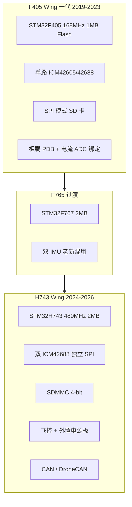

# 固定翼飞控硬件演进分析与 2026 H7 产品定义

> 基于 ArduPilot 仓库 `libraries/AP_HAL_ChibiOS/hwdef` 中 SpeedyBeeF405WING、AET-H743-Basic、MatekH743 等板卡的 `hwdef.dat` 分析整理。  
> 目标读者：硬件/固件/产品规划；面向全球销售的 H7 + 外置 PDB + ArduPilot / iNav 双固件路线。

---

## 目录

1. [架构演进概览](#1-架构演进概览)
2. [经典板卡 hwdef 深度对比](#2-经典板卡-hwdef-深度对比)
3. [固定翼取向板卡清单](#3-固定翼取向板卡清单)
4. [硬件接口共性抽象](#4-硬件接口共性抽象)
5. [2026 全球市场趋势与痛点](#5-2026-全球市场趋势与痛点)
6. [新型 H7 产品定义建议](#6-新型-h7-产品定义建议)
7. [外置 PDB 与线束规范](#7-外置-pdb-与线束规范)
8. [固件双栈与验证清单](#8-固件双栈与验证清单)
9. [市场定位与不建议事项](#9-市场定位与不建议事项)
10. [参考母版与下一步](#10-参考母版与下一步)

---

## 1. 架构演进概览

固定翼飞控在 ArduPilot 生态中**不单独维护「仅 Plane」的 hwdef**；同一 `hwdef.dat` 通过编译 ArduPlane / ArduCopter 区分车型。  
「固定翼取向」体现在：**多路 PWM（舵面/襟翼）、空速 ADC、双路电池监测、舵机 BEC、多 UART（GPS/数传/HD 图传）** 等硬件布局。



| 代际 | 代表板卡 | 市场角色 |
|------|----------|----------|
| F405 Wing | SpeedyBeeF405WING、MatekF405-Wing、JHEMCU405WING | 高性价比入门翼、FPV 长航时 |
| F765 Wing | MatekF765-Wing | 过渡产品，逐步被 H7 替代 |
| H743 Wing/Basic | AET-H743-Basic、MatekH743、TBS Lucid H7 Wing、KakuteH7-Wing | 垂起、多舵面、双 GPS、专业翼 |

---

## 2. 经典板卡 hwdef 深度对比

### 2.1 SpeedyBeeF405WING — 高性价比 / 传统一体化架构

| 项目 | 规格（hwdef.dat） |
|------|-------------------|
| **MCU** | `STM32F405xx`，8MHz 晶振，**1MB Flash** |
| **IMU** | 单路 `ICM42605`，SPI1，`HAL_DEFAULT_INS_FAST_SAMPLE 1` |
| **气压计** | SPL06，I2C1 |
| **罗盘** | 无内置；`ALLOW_ARM_NO_COMPASS` + 外接 I2C 罗盘 |
| **OSD** | MAX7456，SPI2 |
| **存储** | SPI3 接 SD 卡（低速，相对 H7 SDMMC 为短板） |
| **串口** | `SERIAL_ORDER`: USB + USART1~6（6 路 UART） |
| **PWM** | 12 路（含 LED/辅助），部分 `BIDIR` 支持 DShot |
| **空速** | `HAL_DEFAULT_AIRSPEED_PIN 15`（PC5，与 RSSI/压力 ADC 复用设计） |
| **电源监测** | 板载 ADC：电压 PC0、电流 PC1；`BATT_VOLT_SCALE` / `CURR_SCALE` 与 **板载 PDB 强绑定** |
| **Flash 策略** | `include ../include/minimize_fpv_osd.inc`，裁剪云台等驱动以塞进 1MB |

**架构特点：**

- 算力与闪存到 2026 年已偏紧：新功能需持续 `undef` 裁剪，不利于长期维护 ArduPilot 全功能。
- **一体化**：大电流走线、电流采样、飞控在同一块 PCB，大电流磁场易干扰 IMU（虽多数翼机不用板载罗盘）。
- **差异化功能**：SERIAL6 接内置无线模块（MAVLink2 遥测），VTX 电源 GPIO（PINIO1），受 FPV 用户欢迎。

**典型引脚逻辑（摘要）：**

```
SPI1  → ICM42605
SPI2  → MAX7456 OSD
SPI3  → microSD
USART1 → ELRS / 串口 RC
USART2 → SBUS（反相 RCIN）
USART3 → GPS
UART4/5/6 → 用户 / DJI / 内置 WiFi 遥测
```

---

### 2.2 AET-H743-Basic — 高端算力 / 分体电源现代架构

| 项目 | 规格（hwdef.dat） |
|------|-------------------|
| **MCU** | `STM32H743xx`，2MB Flash，`HAL_STORAGE_SIZE 32768` |
| **IMU** | 双路 `ICM42688`，SPI1 + SPI4，`DMA_NOSHARE SPI1* SPI4*` |
| **气压计** | SPL06 / DPS310（I2C） |
| **OSD** | MAX7456，SPI2 |
| **存储** | **SDMMC1** 4-bit（PC8–PC12, PD2） |
| **串口** | 8 路 UART + USB×2（含 SLCAN USB） |
| **PWM** | **13 路** |
| **CAN** | CAN1 + Silent 控制脚 |
| **空速** | `HAL_DEFAULT_AIRSPEED_PIN 4`（PC4） |
| **电源** | **双路** BATT + BATT2 电压/电流 ADC；大功率 BEC 在 **外置电源板** |
| **机械** | 核心板 + 电源板分体（约 36×47×17 mm，45 g 级） |

**架构特点：**

- 飞控专注「大脑」：不承担 100A+ 大电流热应力，EMC 与认证边界更清晰。
- 双 IMU + 高采样 + 大容量参数存储，适合 EKF3、Lua、高频日志。
- 默认串口映射已按固定翼/长航时习惯分配（双 GPS、多 MAVLink、RCIN）。

---

### 2.3 MatekH743（H743-WING）— 生态标杆 / 多硬件版本并存

| 项目 | 规格（hwdef.dat 注释与定义） |
|------|------------------------------|
| **MCU** | STM32H743，与 AET 同档 |
| **IMU** | 多版本兼容定义：V3 为 **ICM42688 + ICM42605**；旧版 MPU6000 / ICM20602 |
| **PWM / UART / CAN / SDMMC** | 与 AET-H743 高度同构（13 PWM、8 UART、CAN、空速 ADC PC4） |
| **外设** | SPI3 预留 `EXT_CS`（可接外设）；`env BUILD_ABIN True` 支持 bootloader 刷写 |
| **iNav** | 社区 target 成熟，为全球 Wing 用户事实标准之一 |

**与 AET 差异要点：**

- Matek 长期迭代 V1→V3 IMU 变更，hwdef 中保留多 IMU 探测条目以兼容存量板。
- 新品设计应 **固定 BOM（双 42688）**，避免继续堆叠老 IMU 兼容逻辑。

---

### 2.4 三档横向对比表

| 维度 | F405 Wing | F765 Wing | H743 Wing/Basic |
|------|-----------|-----------|-----------------|
| **MCU 主频 / Flash** | 168MHz / 1MB | 216MHz / 2MB | 480MHz / 2MB |
| **IMU** | 单 42605/42688 | ICM20602 + MPU6000 等 | 双 ICM42688 为主 |
| **SD 卡** | SPI | 视板而定 | SDMMC |
| **UART** | 6 | 8 | 8+ |
| **CAN** | 通常无 | 有 | 有 |
| **PWM** | 10–12 | 13 | 13–14 |
| **空速 ADC** | 常见 | 常见 | 常见 |
| **PDB** | 板载一体化 | 板载为主 | **分体趋势** |
| **价格带（零售粗估）** | $30–50 | $60–80 | $80–130 |
| **固件** | ArduPilot + iNav（F405SE 系） | 两者 | ArduPilot 完善；iNav 需维护 target |
| **2026 推荐度** | 不推荐新立项 | 不推荐新立项 | **推荐** |

---

## 3. 固定翼取向板卡清单

### 3.1 名称含 WING / Wing（本仓库 14 款）

| 板名 | MCU | Flash | IMU | 气压计 | 空速 ADC | PWM≈ |
|------|-----|-------|-----|--------|----------|------|
| SpeedyBeeF405WING | F405 | 1MB | ICM42605×1 | SPL06 | ✓ | 12 |
| LongBowF405WING | F405 | 1MB | ICM42688×1 | SPL06 | ✓ | 12 |
| JHEMCUF405WING | F405 | 1MB | ICM42605×1 | SPL06 | ✓ | 12 |
| BOTWINGF405 | F405 | 1MB | ICM42688×1 | DPS310 | — | 12 |
| MatekF405-Wing | F405 | 1MB | MPU6000+42688 | BMP280/DPS310 | — | 10 |
| KakuteF4-Wing | F405 | 1MB | ICM42688×1 | SPL06 | — | 10 |
| HEEWING-F405 / v2 | F405 | 1MB | ICM42688×1 | SPL06 | ✓ | 9 |
| MatekF765-Wing | F767 | 2MB | ICM20602+MPU6000 | 多种 | ✓ | 13 |
| KakuteH7-Wing | H743 | 2MB | BMI088+42688 | BMP280/SPL06 | — | 14 |
| TBS_LUCID_H7_WING | H743 | 2MB | ICM42688×2 | DPS310 | ✓ | 13 |
| BlitzWingH743 | H743 | 2MB | 继承 BlitzH743Pro | DPS310/SPL06 | ✓ | 13 |

### 3.2 命名不带 Wing、但属同档对标

| 板名 | 定位 |
|------|------|
| **AET-H743-Basic** | 分体电源、双 42688、13 PWM、8 UART+CAN |
| **MatekH743** | hwdef 注释为 Matek H743-WING，iNav/ArduPilot 标杆 |
| AtomRCF405NAVI 等 | F405 导航翼，带空速，偏巡航空 |

---

## 4. 硬件接口共性抽象

### 4.1 F405 Wing 典型拓扑

```
                    ┌─────────────────┐
   电池 ──► PDB ──►│ STM32F405       │
        (板载)     │  SPI1: IMU×1    │
        ADC V/I    │  SPI2: OSD      │
                    │  SPI3: SD      │
                    │  I2C: 气压计    │
                    │  UART×6 + USB  │
                    │  PWM×10~12     │
                    │  ADC: 空速/RSSI │
                    └─────────────────┘
```

**软件侧共性：**

- `define ALLOW_ARM_NO_COMPASS` + `HAL_PROBE_EXTERNAL_I2C_COMPASSES`
- `HAL_BATT_MONITOR_DEFAULT 4`（Analog 电压+电流）
- MAX7456 模拟 OSD 为标配；UART MSP 接 HD 图传

### 4.2 H743 Wing / Basic 典型拓扑

```
  外置 PDB ──排线──► ┌─────────────────┐
  (大电流/BEC)      │ STM32H743       │
  Vbat/Curr/5V      │  SPI1+SPI4: 双IMU│
                    │  SPI2: OSD      │
                    │  SDMMC: microSD │
                    │  I2C×2 + CAN1   │
                    │  UART×8 + USB   │
                    │  PWM×13~14      │
                    │  ADC: 空速+双路V/I│
                    └─────────────────┘
```

**相对 F405 的质变：**

| 能力 | F405 | H743 |
|------|------|------|
| 黑匣子写入 | SPI SD，带宽低 | SDMMC，适合高频日志 |
| IMU 冗余 | 无 | 双 SPI + DMA 并发 |
| VTOL / 多舵面 | PWM/Flash 紧张 | 13+ PWM，算力充裕 |
| 外设扩展 | 无 CAN | DroneCAN GPS/空速/电调 |
| 固件裁剪 | 必须 minimize | 可保留完整功能集 |

---

## 5. 2026 全球市场趋势与痛点

### 5.1 趋势

| 趋势 | 说明 | 对硬件的要求 |
|------|------|----------------|
| **数字图传普及** | DJI O4 / Walksnail / HDZero | UART MSP DisplayPort；模拟 OSD 降为备选 |
| **模块化 PDB** | 大电流与飞控分离 | FC 仅 ADC 采样；PDB 可换型 |
| **双固件生态** | ArduPilot（垂起/专业）+ iNav（FPV/入门翼） | 引脚对齐 Matek/AET；首发 iNav target PR |
| **无线调参** | 飞场少插 USB | 内置 WiFi/BLE 模块（独立 UART，参考 SpeedyBee） |
| **监管** | Remote ID（欧美） | 预留 UART/CAN 焊盘与文档 |
| **接收机** | ELRS / CRSF 主流 | 全双工 UART + 硬件说明（反相/半双工） |

### 5.2 痛点（一体化大板模式）

1. **体积与散热**：100A+ PDB 与飞控同板 → 厚重、发热、维修整块更换。  
2. **EMC**：大电流走线靠近 IMU → 陀螺噪声、若误装板载罗盘则磁干扰严重。  
3. **Flash/算力焦虑（F405）**：`minimize_fpv_osd.inc` 类裁剪不可持续。  
4. **区域差异难 SKU**：欧美重翼大电流 vs 东南亚轻翼，一体化 PDB 难以一款通吃。

---

## 6. 新型 H7 产品定义建议

### 6.1 产品定位（一句话）

> **「H743 Wing Pro — 飞控大脑 + 可换 PDB 生态」**  
> STM32H743 + 双 ICM-42688-P + 外置分电/霍尔电流计 + **ArduPilot Plane & iNav 双固件官方支持**。

### 6.2 核心飞控模块（The Core）

| 模块 | 建议规格 | 设计理由 |
|------|----------|----------|
| **MCU** | STM32H743VIT6（**2MB Flash**）；慎选 H723/H750 作首款 | 与 Matek/AET/TBS 一致；固件膨胀余量；社区 target 最多 |
| **IMU** | **双 ICM-42688-P**，SPI1 + SPI4，独立 CS；一颗硬固定 + 一颗软减震 | 冗余、振动环境、对标 2026 竞品 |
| **气压计** | DPS310 或 SPL06，I2C，靠近静压孔布线说明 | hwdef 兼容性好 |
| **罗盘** | **不内置**；GPS 罗盘专用连接器 + I2C 扩展 | 翼机 90% 用外置 GPS 罗盘 |
| **PWM** | **12–14 路**，丝印 S1–S8 / AUX1–AUX6（襟翼/轮刹/VTOL） | 多舵面是 H7 相对 F405 的核心卖点 |
| **UART** | **≥7 路** + USB-C | GPS1/2、TELEM、RC(CRSF)、VTX(MSP)、Spare、WiFi/BLE |
| **CAN** | 1× CAN1 + 120Ω 终端跳线 + Silent | DroneCAN GPS/空速/专业用户 |
| **空速** | 专用 **ADC** 皮托管接口 + 可选 I2C 数字空速焊盘 | ArduPilot Plane / iNav 固定翼刚需 |
| **OSD** | AT7456（模拟）+ UART **MSP DisplayPort** | 全球模拟+数字图传并存 |
| **存储** | **SDMMC** microSD，弃 SPI SD | 高频黑匣子 |
| **逻辑电源** | FC 上 5V/3A（逻辑+外设）；**不在 FC 上大电流 BEC** | 热应力与认证简化 |
| **尺寸** | 30.5×30.5 或 36×36 堆叠孔距；厚度 &lt; 8 mm 目标 | 兼容现有笼架/安装习惯 |
| **无线** | 可选模块 UART（ESP32/蓝牙），参考 SpeedyBee SERIAL6 | 飞场无线调参差异化 |

### 6.3 IMU 安装建议

| 安装方式 | 用途 |
|----------|------|
| IMU1 硬连接 | 低延迟、竞速/灵敏舵面 |
| IMU2 硅胶减震 | 滤除机身高频振动、长航时稳定 |

两颗 IMU **不得共用 SPI 总线**；hwdef 中应 `DMA_NOSHARE SPI1* SPI4*`（参考 AET）。

### 6.4 串口默认映射（建议与 Matek/AET 对齐）

便于用户换固件、降低文档成本：

| 逻辑端口 | 建议功能 | 协议/备注 |
|----------|----------|-----------|
| SERIAL0 | USB | 调参 / 刷机 |
| SERIAL1 | TELEM1 | MAVLink2 |
| SERIAL2 | GPS1 | NMEA/UBX |
| SERIAL3 | TELEM2 / MSP | MAVLink2 或 DisplayPort |
| SERIAL4 | GPS2 / ESC telem | 第二 GPS 或电调遥测 |
| SERIAL5 | USB2 / SLCAN | 可选 CAN 适配 |
| SERIAL6 | RC IN | CRSF / SBUS（硬件反相说明） |
| SERIAL7 | TELEM3 / BLE | 无线模块 |
| SERIAL8 | USER | 备用 |

> 具体 STM32 引脚复用需与 **AET-H743-Basic**、**MatekH743** 对照后一次性冻结，再同步 iNav `target.h`。

### 6.5 PWM 通道功能丝印（全球电商可读）

| 通道 | 建议丝印 | 典型用途 |
|------|----------|----------|
| 1–4 | M1–M4 或 AIL-L/R、ELE | 电机 / 副翼 / 升降 |
| 5–6 | RUD / THR | 方向 / 油门 |
| 7–8 | FLAP / GEAR | 襟翼 / 起落架 |
| 9–12 | AUX1–4 | 相机、抛投、VTOL 舵机 |
| 13–14 | LED / SPARE | WS2812 / 备用 |

---

## 7. 外置 PDB 与线束规范

### 7.1 设计理念（最大卖点）

将 **PDB、大电流霍尔/分流计、大功率 BEC（5V/6V/7.4V 舵机、9V/12V VTX）** 全部置于 **独立电源模块**；飞控通过排线仅接收：

- 电压采样（分压至 ADC）
- 电流采样（霍尔 0–3.3V 或放大器输出）
- 可选第二路 V/I（副包 / 舵机回路监测）
- 逻辑 5V 供电（小电流）
- 可选 CAN 直通

**优势：**

- 飞控本体可做到 30.5×30.5 或条形小型化；
- 炸机常只坏 PDB，降低全球 RMA 运费；
- 电磁干扰远离 IMU 区域；
- 按市场推出 **PDB-A / PDB-B** 而不改飞控。

### 7.2 PDB 模块化 SKU 建议

| 型号 | 目标场景 | 规格要点 |
|------|----------|----------|
| **PDB-A** | 轻翼 FPV / 2–6S | 持续 80–120A，单路 V/I，5V 2A + 9V 2A VTX |
| **PDB-B** | 重翼 / 垂起 | 持续 150–200A，**双路** V/I，舵机 BEC 6V/7.4V **10A**，VTX GPIO 开关 |
| **PDB-C** | 测绘 / 商用 | 加 EMI 滤波、更大焊盘、CAN 终端 |

### 7.3 FC ↔ PDB 排线定义（建议 8–10 pin GH1.25）

| Pin | 信号 | 说明 |
|-----|------|------|
| 1 | VBAT+ | 至 FC ADC 分压（不承载电机大电流） |
| 2 | GND | 功率地参考 |
| 3 | CURR | 主电流 ADC |
| 4 | VOLT | 主电压 ADC（若与 Pin1 分压重复可合并设计） |
| 5 | CURR2 | 副路电流（可选） |
| 6 | VOLT2 | 副路电压（可选） |
| 7 | +5V | 逻辑供电，来自 PDB 稳压 |
| 8 | CAN_H / CAN_L | 可选，或 UART ESC telem |
| 9–10 | 保留 | 加热膜、抛投电源检测等 |

**参数标定：** 每款 PDB 出厂提供 `BATT_VOLT_SCALE`、`BATT_CURR_SCALE`（及 BATT2）推荐值，写入 `defaults.parm` 与 iNav 等效配置说明。

---

## 8. 固件双栈与验证清单

### 8.1 ArduPilot

1. 在 `libraries/AP_HAL_ChibiOS/hwdef/YourBrand-H743-Wing/` 新增 `hwdef.dat`、`hwdef-bl.dat`、`defaults.parm`。  
2. 在 `Tools/AP_Bootloader/board_types.txt` 申请 `AP_HW_*` ID。  
3. 构建：`./waf configure --board YourBrand-H743-Wing && ./waf plane`。  
4. 验证：双 IMU 检测、空速 ADC、SD 日志、13 PWM 输出、CAN 枚举。

### 8.2 iNav

1. 硬件立项阶段 **并行** 编写 iNav `target.h` / `target.c`，引脚与 ArduPilot **逐脚对齐**。  
2. 向 [iNavFlight/inav](https://github.com/iNavFlight/inav) 提交 target PR（参考 ORBITH743、BROTHERHOBBYH743、DAKEFPVH743 等 H743 合入案例）。  
3. 验证：固定翼混控、OSD、空速计、SD 黑匣子、ELRS 全双工。

### 8.3 硬件出厂测试

| 项 | 方法 | 通过标准 |
|----|------|----------|
| 电压 ADC | 可调电源 + 万用表对比 | 误差 &lt; 2% |
| 电流 ADC | 电子负载 + 钳流表 | 线性区 0–标称 A |
| 双 IMU | 地面站加速度计界面 | 双 IMU 在线且轴向合理 |
| 空速 ADC | 模拟电压 / 皮托管 | 读数随压差变化 |
| SDMMC | 高频日志写入 | 无掉卡、无 CRC 错误 |
| PWM | 示波器 / 舵机 | 13 路独立、频率可配 |

---

## 9. 市场定位与不建议事项

### 9.1 价格带（粗线条，供规划）

| SKU | 目标零售 |
|-----|----------|
| FC 单板（双 IMU + H743 + OSD + SD） | $79–99 |
| FC + PDB 套装 | $99–129 |
| 单独 PDB 更换件 | $25–45 |

### 9.2 区域与固件策略

| 区域/用户群 | 主固件 | 卖点 |
|-------------|--------|------|
| 北美 / 欧盟 FPV 长航时 | iNav + ArduPilot | HD 图传、空速、双 IMU |
| 垂起 / 商用 | ArduPilot Plane | 多 PWM、双 GPS、CAN |
| 拉美 / 东南亚 入门翼 | iNav 为主 | 价格敏感、模拟 OSD 仍多 |

### 9.3 2026 差异化卖点

1. **双固件官方支持**（盒装 + 下载页同一入口）  
2. **VTOL-ready 通道丝印**（13 PWM 功能标注）  
3. **分体 PDB 系列化**（一款飞控、多款 PDB）  
4. **开源 hwdef / 早进 board_types**（社区信任）  
5. **Remote ID 预留**（UART/CAN 焊盘 + 合规说明）  
6. **多语言接线图**（英 / 西 / 日，电商转化）

### 9.4 不建议做的

| 不建议 | 原因 |
|--------|------|
| 新 F405 Wing | 市场饱和；1MB Flash 限制 ArduPilot；毛利低 |
| 飞控一体化 200A PDB | 与分体策略相反；散热/EMC/售后差 |
| 首发 H723/H750 省 BOM | 双固件参考设计少；工具链支持弱于 H743 |
| 内置罗盘 | 翼机少用；占 I2C；易受大电流干扰 |
| 仅 ArduPilot 无 iNav | 丢失全球 FPV/翼机半数渠道 |

---

## 10. 参考母版与下一步

### 10.1 hwdef 参考优先级

| 优先级 | 板卡 | 参考内容 |
|--------|------|----------|
| 1 | **AET-H743-Basic** | 分体电源、双 SPI IMU、双路 V/I、13 PWM、CAN |
| 2 | **MatekH743** | iNav 生态、IMU 版本注释、BUILD_ABIN |
| 3 | **TBS_LUCID_H7_WING** | HD 图传 UART、VTX 电源 GPIO、双 42688 |
| 4 | SpeedyBeeF405WING | 仅参考无线遥测 UART、VTX PINIO；**不作为 H7 引脚模板** |

### 10.2 建议的后续工程交付物

- [x] `ZZZ-EVTOL-H753/hwdef.dat` — 见 `libraries/AP_HAL_ChibiOS/hwdef/ZZZ-EVTOL-H753/`（board ID **7121**，MCU **H753**）  
- [ ] 引脚冻结表（Excel / MD）  
- [ ] iNav `target.h` 与 ArduPilot 引脚 **逐脚对齐检查表**  
- [ ] PDB-A/B 原理图 + 8pin 线序规范书  
- [ ] `defaults.parm`（Plane）+ iNav 固定翼预设说明  
- [ ] 英文快速接线图（PDF）

### 10.3 与贵司方案对照

| 贵司计划 | 结论 |
|----------|------|
| H7（H743） | ✅ 与 2026 主流一致 |
| iNav + ArduPilot | ✅ 需立项并行 target |
| 外置 PDB + 电流计 | ✅ 对标 AET；建议 PDB SKU 化 |
| 全球销售 | ✅ 双固件 + 分体认证 + 多语言文档 + Remote ID 预留 |

---

## 附录 A：SpeedyBeeF405WING 关键 hwdef 摘录

```text
MCU STM32F4xx STM32F405xx
IMU Invensensev3 SPI:icm42605 ROTATION_ROLL_180_YAW_270
BARO SPL06  I2C:0:0x76
define HAL_DEFAULT_AIRSPEED_PIN 15
include ../include/minimize_fpv_osd.inc
```

## 附录 B：AET-H743-Basic 关键 hwdef 摘录

```text
MCU STM32H7xx STM32H743xx
IMU Invensensev3 SPI:icm42688_0 ROTATION_YAW_180
IMU Invensensev3 SPI:icm42688_1 ROTATION_YAW_270
define HAL_DEFAULT_AIRSPEED_PIN 4
SERIAL_ORDER OTG1 USART1 USART2 USART3 UART4 OTG2 USART6 UART7 UART8
```

---

*文档版本：2026-05 · 基于 ardupilot-ubuntu 仓库 hwdef 分析 · 仅供内部产品/硬件规划使用。*
