# Example - LIMO (Isaac Sim)


Here is an introduction to the ROS MCP server’s capabilities using the robot simulator Isaac Sim with the mobile robot LIMO!

This example includes the Isaac Sim Docker installation and execution, as well as a USD file with the LIMO robot equipped with a camera and LiDAR sensor. This setup allows you to easily configure the LIMO robot environment within Isaac Sim.

## System Requirements
 This example requires a PC that meets the minimum specifications to run Isaac Sim. Please refer to the [System Requirements](https://docs.isaacsim.omniverse.nvidia.com/5.0.0/installation/requirements.html) to prepare the appropriate hardware.

## Prerequisites

✅ **Note:** This example is designed to run on Linux with ROS2 installed and has been tested on the following versions:
- **OS**: Ubuntu 20.04, 22.04
- **ROS2**: Foxy, Humble
- **Isaac Sim**: Local versions 4.5.0, 5.0.0 and Docker versions 4.5.0, 5.0.0

This example is written based on **Docker Isaac Sim 5.0.0** to maximize accessibility and minimize dependencies.

⚠️ **Windows Users:** If you're using Windows with WSL2, Isaac Sim Docker will not work due to WSL2 GPU passthrough limitations. Instead, install Isaac Sim natively on Windows and follow the Windows-specific instructions in the Quick Start section below.

**Linux Users:**
Before starting this example, make sure you have the following installed:
- **ROS2**: [Install ROS2](https://docs.ros.org/en/dashing/Installation/Ubuntu-Install-Binary.html)
- **Docker**: [Install Docker](https://docs.docker.com/get-docker/)

**Windows Users:**
Before starting this example, make sure you have the following installed:
- **WSL2**: [Install WSL2](https://learn.microsoft.com/en-us/windows/wsl/install)
- **ROS2 in WSL2**: [Install ROS2](https://docs.ros.org/en/humble/Installation/Ubuntu-Install-Binary.html)
- **NVIDIA GPU Drivers**: Latest drivers for your GPU

## Quick Start

### Setup
<details>
<summary><strong>For Linux: Docker-based Setup</strong></summary>

### 1. Isaac Sim Container Installation
Follow the instructions on the [Isaac Sim Container Installation](https://docs.isaacsim.omniverse.nvidia.com/5.0.0/installation/install_container.html) to install the Isaac Sim Docker container.

### 2. Download Isaac Sim WebRTC Streaming Client
Follow the instructions on the [Isaac Sim WebRTC Streaming Client](https://docs.isaacsim.omniverse.nvidia.com/5.0.0/installation/download.html#isaac-sim-latest-release) to download and install the WebRTC streaming client.
In this example, the WebRTC Streaming Client was downloaded and executed as follows.
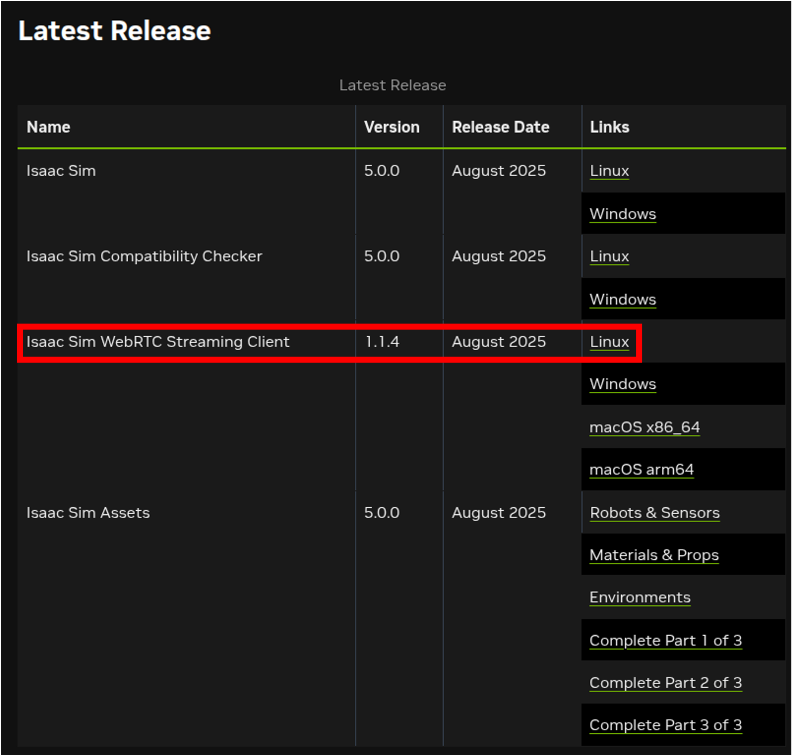

#### 3. Check Installation
To verify that the Isaac Sim Container and WebRTC Streaming Client are properly installed, please follow the steps below.

In the terminal where the Isaac Sim Container is running, execute the following command to run Isaac Sim with native livestream mode.
```bash
./runheadless.sh -v
```
When the message `Isaac Sim Full Streaming App is loaded.` appears, it means the application has been launched successfully.

After that, move to the folder where you downloaded the Isaac Sim WebRTC Streaming Client in a new terminal and run the following command to execute the client.
```bash
./isaacsim-webrtc-streaming-client-1.1.4-linux-x64.AppImage
```

When the GUI is displayed as shown below, it means the application has been launched successfully.

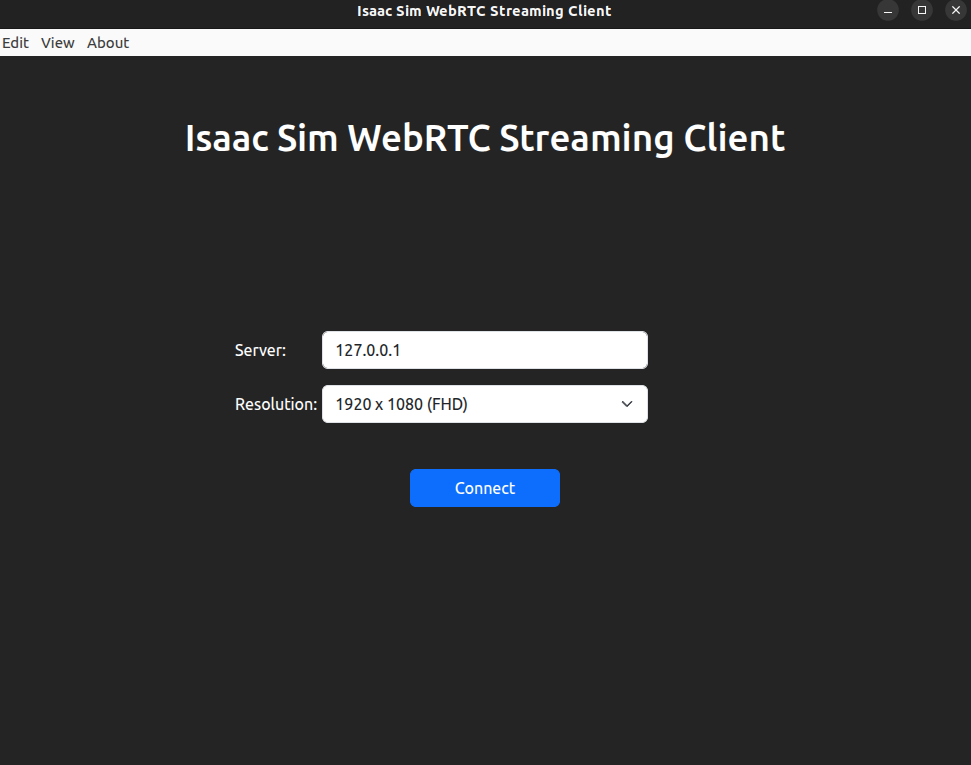

If the above steps have been executed successfully, press the Connect button on the Isaac Sim WebRTC Streaming Client to check if the Isaac Sim screen appears.
✅ **Note:** This example is based on installing and running the Isaac Sim container and the Isaac Sim WebRTC streaming client on the same local PC. Therefore, the server address for the Isaac Sim WebRTC Streaming Client is `127.0.0.1`. If the Isaac Sim container is running on another PC, you need to enter the IP address of that PC.

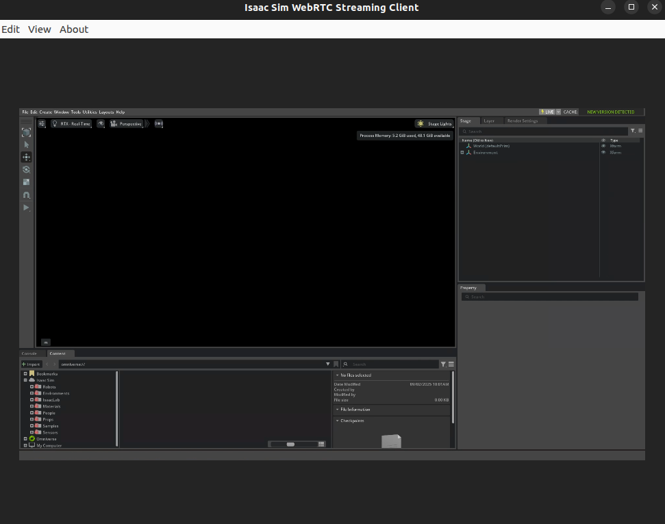

### 4. Copy LIMO example USD file to Isaac Sim
Copy the USD file of the LIMO robot created for this example to Isaac Sim.

```bash
cd <YOUR_PATH>/ros-mcp-server/examples/3_limo_mobile_robot/isaac_sim/usd/
docker exec <container_name> mkdir -p /example # default container_name : isaac-sim
docker cp ./limo_example.usd <container_name>:/example/limo_example.usd
```

If successfully copied, you can verify the USD file in the Isaac Sim screen as shown below.
```bash
Path : My Computer > / > example > limo_example.usd
```

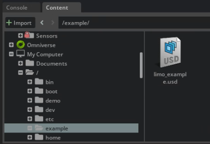

### 5. Launch LIMO Example
Now, double-click the `limo_example.usd` file to run it in Isaac Sim. You should see the LIMO robot loading in the simulation environment as shown below.

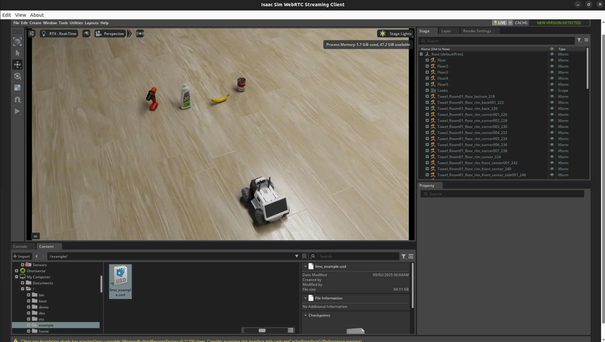

### 3. Start rosbridge

If the LIMO robot is running properly in Isaac Sim and ROS2 topics have been created, run rosbridge in the terminal to enable communication with the ros-mcp-server. Execute rosbridge using the following command:

```bash
ros2 launch rosbridge_server rosbridge_websocket_launch.xml
```

</details>

<details>
<summary><strong>For Windows: Native Setup with WSL2</strong></summary>

### 1. Install Isaac Sim for Windows

Download and install Isaac Sim for Windows:

1. Visit the [Isaac Sim Download Page](https://docs.isaacsim.omniverse.nvidia.com/5.0.0/installation/download.html)
2. Download the Windows version
3. Extract the archive to your desired location (e.g., `C:\isaac_sim`)

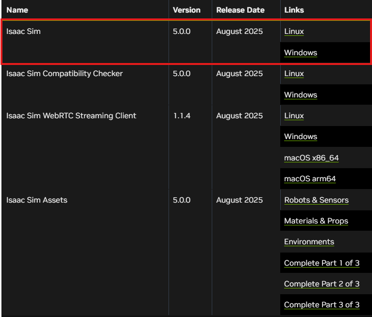

**Note:** Remember the installation path as you'll need it in the next steps.

### 2. Configure Windows Environment and Launch Isaac Sim

Open PowerShell and configure the environment variables to enable ROS2 bridge:

```powershell
# Set Isaac Sim installation path (modify this to match your installation)
$env:ISAAC_SIM_PATH = "C:\isaac_sim"

# Set ROS2 distribution (change to 'foxy' if using ROS2 Foxy)
$env:ROS_DISTRO = "humble"

# Set RMW implementation
$env:RMW_IMPLEMENTATION = "rmw_fastrtps_cpp"

# Add ROS2 bridge library to PATH
$env:PATH = "$env:ISAAC_SIM_PATH\exts\isaacsim.ros2.bridge\$env:ROS_DISTRO\lib;$env:PATH"

# Move to the isaac folder
cd $env:ISAAC_SIM_PATH

# Launch Isaac Sim with the ROS2 bridge extension
& "$env:ISAAC_SIM_PATH\isaac-sim.bat" --/isaac/startup/ros_bridge_extension=isaacsim.ros2.bridge
```

**Important:** Replace `C:\isaac_sim` with your actual Isaac Sim installation path, and adjust `ROS_DISTRO` to match your WSL2 ROS2 version.

Wait for Isaac Sim to fully launch. You should see the Isaac Sim GUI window.

**Verify ROS2 Bridge:**
- Go to: **Window → Extensions**
- Search for: `ros2 bridge`
- Confirm that **isaacsim.ros2.bridge** is ON(enabled).
If it is not, make sure you followed the previous instructions.

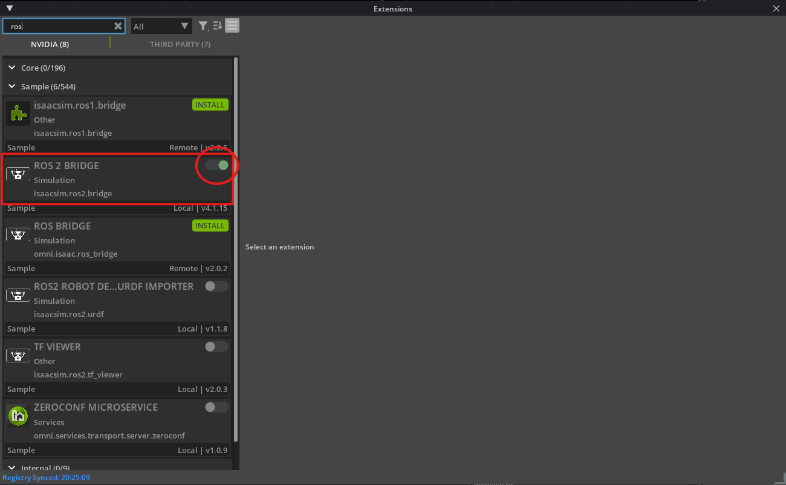

### 3. Start rosbridge

If the LIMO robot is running properly in Isaac Sim and ROS2 topics have been created, run rosbridge to enable communication with the **ros-mcp-server**.

```bash
# Install rosbridge server if not already installed
sudo apt update
sudo apt install ros-humble-rosbridge-server

# Source again to ensure rosbridge is available
source /opt/ros/humble/setup.bash

# Set RMW implementation to match Windows
export RMW_IMPLEMENTATION=rmw_fastrtps_cpp

# Allow ROS2 to communicate across network boundaries
export ROS_LOCALHOST_ONLY=0

# Start rosbridge
ros2 launch rosbridge_server rosbridge_websocket_launch.xml
```

**Note:** If you're using ROS2 Foxy, replace `humble` with `foxy` in the commands above.

### 4. Load LIMO Example in Isaac Sim

1. **Load USD File**
   - In Isaac Sim, go to: **File → Open**
   - Navigate to your cloned repository location:
     - If cloned in Windows: `<YOUR_PATH>\ros-mcp-server\examples\3_limo_mobile_robot\isaac_sim\usd\limo_example.usd`
     - If cloned in WSL2: Access via `\\wsl$\<distro_name>\<YOUR_PATH>\ros-mcp-server\examples\3_limo_mobile_robot\isaac_sim\usd\limo_example.usd`
   - Select and open `limo_example.usd`

   **Alternative:** Drag and drop the USD file from the Content panel at the bottom into the Viewport

You should see the LIMO robot loading in the simulation environment as shown below.


</details>

#### Start Simulation and Check Topics

Now, let's check if the LIMO robot is running properly in Isaac Sim.

1. **Start Simulation**
   - Click the **▶ (Play)** button in the toolbar on the left
   - The button will change to **|| (Pause)** when the physics engine starts running


2. **Check ROS2 Topics**

   Once the simulation starts, ROS2 topics will be created through a predefined [Action Graph](https://docs.isaacsim.omniverse.nvidia.com/latest/omnigraph/omnigraph_tutorial.html) within the USD file.

   Run the following command in your terminal (Linux) or WSL2 terminal (Windows):

   ```bash
   ros2 topic list
   ```

   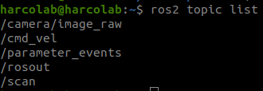

   As shown in the figure, `/camera/image_raw`, `/cmd_vel`, and `/scan` must appear as essential topics.

   Each topic serves the following functions:
   - `/camera/image_raw`: Transmits raw image data collected from the LIMO robot's camera
   - `/cmd_vel`: Transmits movement commands for the LIMO robot
   - `/scan`: Transmits scan data collected from the LIMO robot's LiDAR sensor

## **Integration with MCP Server**
    
If rosbridge is running, you can connect the MCP server to control the robot. If you haven’t set up the MCP server yet, follow the [installation guide](https://github.com/robotmcp/ros-mcp-server/blob/main/docs/install/installation.md) .

Since The **ros-mcp-server** needs to recognize the robot, configure it to connect to the robot’s IP address.

## **Example Walkthrough**
Once all the above connections are completed, you can connect to and control the LIMO robot from the **ros-mcp-server**. Below is an example screen showing the connection to the LIMO robot from the **ros-mcp-server**.

### **Example 1** : Connect to robot

**For Linux:** By default, the Isaac Sim Container is run with the `--network=host` option, so it can access the LIMO robot on the same network as the user's local PC. Therefore, the IP address of the LIMO robot is the same as the user's local PC. Use the `ifconfig` command to find your IP address.

**For Windows:** Find your Windows IP address from WSL2 using: `ip route show | grep -i default | awk '{ print $3}'`

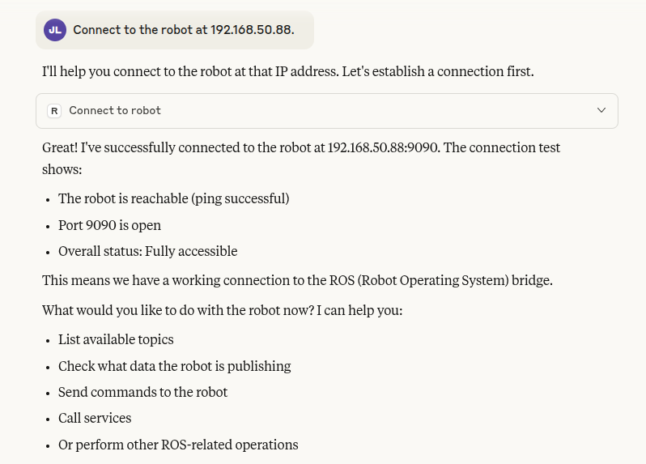

### **Example 2** : ROS2 Topic Check

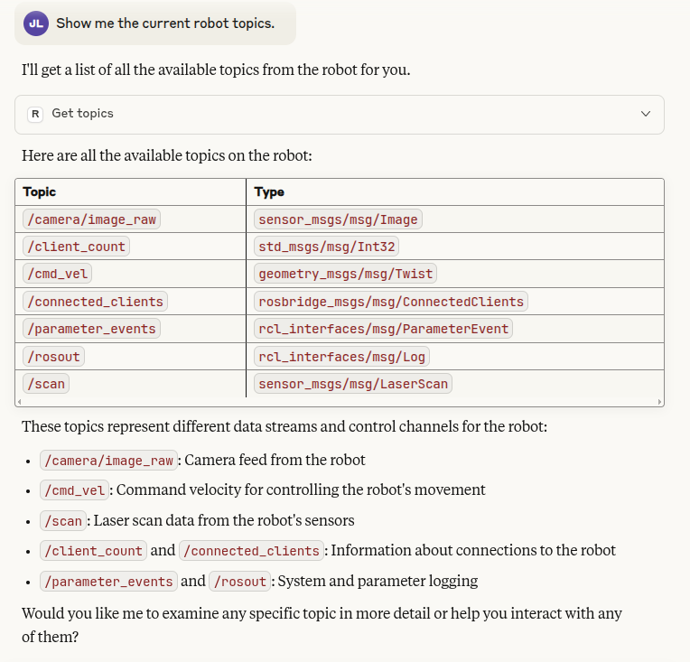

### **Example 3** : Simple Movement

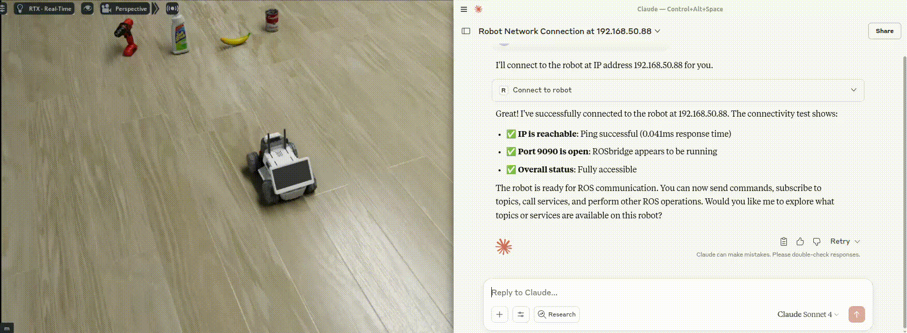

## **Next Steps**
The LIMO is equipped with various sensors, such as vision and LiDAR sensors. Let's make use of them.